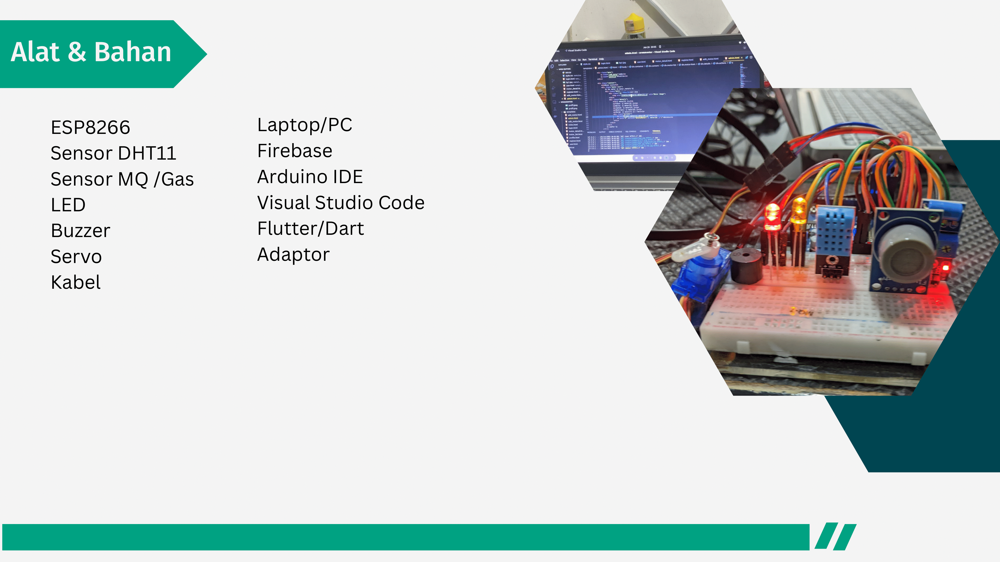
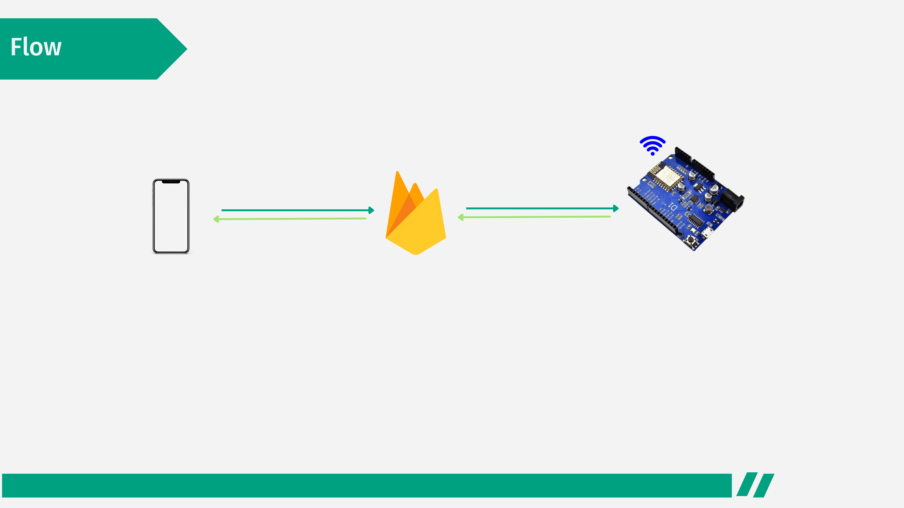
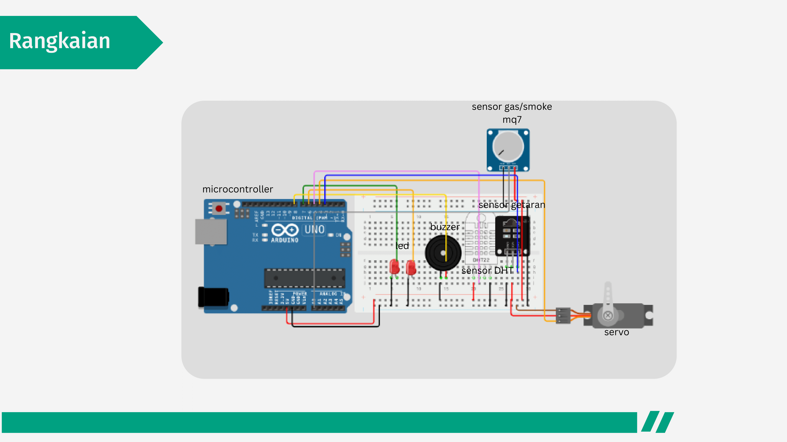
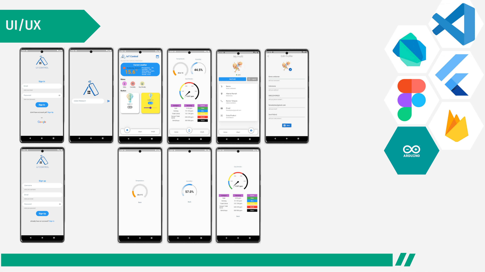

# iotcontrol

A new Flutter project.

## Getting Started

This project is a starting point for a Flutter application.

A few resources to get you started if this is your first Flutter project:

- [Lab: Write your first Flutter app](https://docs.flutter.dev/get-started/codelab)
- [Cookbook: Useful Flutter samples](https://docs.flutter.dev/cookbook)

For help getting started with Flutter development, view the
[online documentation](https://docs.flutter.dev/), which offers tutorials,
samples, guidance on mobile development, and a full API reference.

## Presentasi

Anda dapat melihat presentasi Flutter di sini:

- [Tautan ke Presentasi Flutter](https://github.com/fanes-setiawan/IoTInspector_Apps/blob/main/ppt.pdf)

### Pratinjau Presentasi

1. **Alat dan Bahan:**

   

   Gambar ini menampilkan alat dan bahan yang digunakan dalam proyek ini.

2. **Flow:**

   

   Gambar ini memperlihatkan diagram alur atau flow dari aplikasi yang dikembangkan.

3. **Rangkaian:**

   

   Gambar ini menunjukkan rangkaian atau skema elektronik yang digunakan dalam proyek.

4. **UI/UX:**

   

   Gambar ini merupakan tampilan antarmuka pengguna (UI) atau pengalaman pengguna (UX) dari aplikasi.

